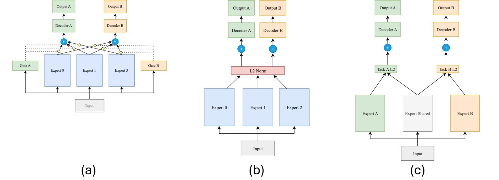
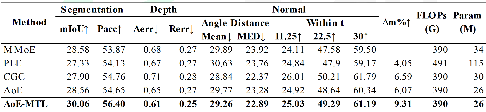

# AoE-MTL: Autonomy of Experts for Multi-Task Learning

[]()
[]()

---

**AoE-MTL** (Autonomy of Experts for Multi-Task Learning) is a lightweight, gate-free multi-task learning framework built on [PyTorch](https://pytorch.org/).  
It extends the original [LibMTL](https://github.com/median-research-group/LibMTL) framework with a new architecture that replaces traditional *gated mixture-of-experts* with a self-activating, L2-norm-based fusion mechanism.

<p align="center">
  
</p>

- (a) Multigate Mixture-of-Experts
- (b) Autonomy of Experts
- (c) AoE-MTL

This implementation corresponds to the model described in the author’s paper, **“AoE-MTL: Gate-Free Expert Selection for Efficient Multi-Task Learning”** available [here](https://doi.org/10.5281/zenodo.17622521)

---

## 🌟 Key Features

- **Gate-Free Expert Fusion:**  
  Experts determine their contribution based on their own activation magnitudes (L2 norms), eliminating the need for learned gating networks.

- **Shared + Task-Specific Experts:**  
  AoE-MTL combines global shared experts for cross-task transfer and task-specific experts for specialization — similar in spirit to CGC/PLE, but without routing layers.

- **Simplicity & Reproducibility:**  
  Designed for research clarity — a single-architecture repository with minimal dependencies, plug-and-play compatibility with NYUv2 and other dense prediction benchmarks.

- **LibMTL Compatibility:**  
  Retains the core trainer, config, and dataset structure of LibMTL for easy adaptation to existing MTL pipelines.

---

### 🧩 Architectural Overview

Autonomy of Experts (AoE-MTL) fuses expert outputs using intrinsic L2-norm weighting:

$$
z^{(t)} \=\ \sum_{k=1}^{N_s + N_t} 
\frac{\lVert y_k^{(t)} \rVert_2}{\sum_m \lVert y_m^{(t)} \rVert_2 + \epsilon}\ y_k^{(t)}
$$

**Where:**
- $y_k^{(t)}$ is the feature map from expert $k$ for task $t$  
- $N_s$ = number of shared experts  
- $N_t$ = number of task-specific experts  

No gating networks, no sparsity constraints — just self-organized routing driven by activations.

---

## 🧱 Supported Components

| Component | Description |
|:----------|:-------------|
| **Architecture** | `AOEMTL` — Autonomy of Experts with shared + per-task experts |
| **Weighting** | `EW` — Equal loss weighting |
| **Backbone** | ResNet-50 (default, dilated for NYUv2) |
| **Trainer** | LibMTL-style single-level trainer |
| **Dataset Example** | NYUv2 (Segmentation + Depth + Normals) |

---

## ⚙️ Installation

### 1. Create an environment
```bash
conda create -n aoemtl python=3.10
conda activate aoemtl
```

### 2. Clone this repository
```bash
git clone https://github.com/anand-amon/aoemtl.git
cd aoemtl
```

### 3. Install dependencies
```bash
pip install torch==2.3.0+cu121 torchvision==0.18.0+cu121 -f https://download.pytorch.org/whl/torch_stable.html
pip install torch-scatter==2.1.2+pt23cu121 torch_sparse==0.6.18+pt23cu121 -f https://pytorch-geometric.com/whl/torch-2.3.0+cu121.html
pip install -r requirements.txt
pip install -e .
```

---

## 🚀 Quick Start (NYUv2 Example)

### 1. Download dataset
Preprocessed NYUv2 data (MTAN format) is available at [here](https://www.dropbox.com/scl/fo/p7n54hqfpfyc6fe6n62qk/AKVb28ZmgDiGdRMNkX5WJvo?rlkey=hcf31bdrezqjih36oi8usjait&e=1&dl=0).

### 2. Train the AoE-MTL model
```bash
cd examples/nyu
python main.py --weighting EW --arch AOEMTL --img_size 3 288 384 --num_experts 2 2 --dataset_path /path/to/nyuv2 --gpu_id 0 --scheduler step
```

### 3. Evaluate performance
```bash
python main.py --mode test --load_path /path/to/checkpoint.pth
```

---

## 📊 Results Summary

Results for NYUDv2, using a simple 7 layer encoder for the experts, other benchmarks can be found on paper.

<p align="center">
  
</p>

## Contact

Anand Enkhbayar
AI Engineer / Researcher
📍 Taipei, Taiwan
📧 anand.e@hotmail.com

🔗 github.com/anand-amon

### License & Attribution

This repository builds upon [LibMTL](https://github.com/median-research-group/LibMTL) by the Median Research Group, licensed under the MIT License.

Modifications, extensions, and new components (AoE-MTL, AoE-CGC, and associated utilities) © 2025 Anand Mogul, released under the same MIT License.
